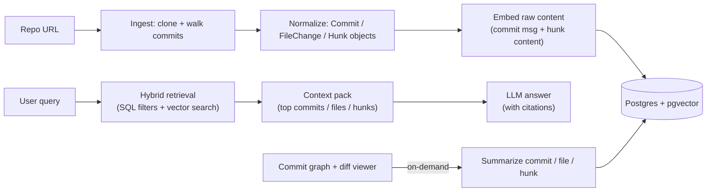

# GitOdyssey: AI-Powered Codebase Exploration

> **Every repo has a story.** We built GitOdyssey to make that story searchable, explorable, and explainable.

[](https://youtu.be/DYcpnQevTuk)

## Why we built GitOdyssey

During onboarding and code review at large companies, understanding why the code looks the way it does can take weeks. You’re not just reading files, you’re reconstructing decisions:

- Why was authentication refactored?
- When did error handling change?
- Which commits touched this module during the incident last quarter?

Modern AI coding assistants help a lot, but they mostly operate on the **current snapshot** of a codebase. During the University of Texas at Austin's annual HackTX hackathon, our team asked a simple question:

> What if your repository’s entire history became an interactive, AI-queryable knowledge graph?

That became **GitOdyssey**: a web app that ingests a Git repo, builds a commit graph, and lets you explore changes visually then ask natural language questions grounded in commit-level evidence.

For the exact tech stack, please refer to the [repo](https://github.com/DylanPina/git-odyssey/tree/main?tab=readme-ov-file).

---

## What is GitOdyssey

- **Interactive commit graph** you can pan/zoom and click through.
- **Monaco diff viewer** (VS Code’s editor) for side-by-side diffs.
- **AI summaries** at multiple levels:
  - commit → file change → hunk (section of a diff)
- **Semantic search + filters** to highlight the most relevant commits.
- **Chat with citations** so answers stay grounded in specific commits.

Recommended visuals to include (from this repo):

- Landing: `docs/landing.png`
- Search highlighted nodes: `docs/search_highlight.jpg`
- Diff experience: `docs/diff.jpg` and `docs/diff_2.jpg`
- Summaries: `docs/summary_1.jpg`
- Chat: `docs/chat.png`

If you’re publishing on a site with an assets pipeline, here are the placements I’d use:

<div class="image-container"></div>
<p style="font-size: 0.8rem; text-align: center;"><em>Fig-1: Our interactive git graph UI</em></p>

<div class="image-container"></div>
<p style="font-size: 0.8rem; text-align: center;"><em>Fig-2: Summarization in action</em></p>

<div class="image-container"></div>
<p style="font-size: 0.8rem; text-align: center;"><em>Fig-3: Chat grounded in repository history</em></p>

---

## Git’s internals (and why they matter)

Git looks like a list of commits, but internally it’s a **directed acyclic graph (DAG)**.

### The core objects

- **Blob**: raw content of a file (bytes)
- **Tree**: directory structure (pointers to blobs and other trees)
- **Commit**: points to a tree, plus metadata (author/time/message) and **parent commit(s)**

This is why Git history is naturally a graph: merges create commits with multiple parents.

### Diffs, patches, and hunks

GitOdyssey is fundamentally about change, and in Git that means **diffs**:

- A **diff** (loosely) describes how to transform one snapshot into another.
- A **patch** is the textual representation of that diff.
- A **hunk** is a contiguous block of changed lines inside a patch.

A typical unified diff has hunk headers like:

```diff
@@ -10,7 +10,11 @@
```

Which reads like: “around line 10, remove 7 lines from the old file and add 11 lines to the new file.” Hunks are the perfect granularity for developer tooling because they are:

- small enough to summarize accurately
- large enough to capture intent (more than single-line changes)
- easy to jump to inside a diff viewer

GitOdyssey is built around that idea: commits aren’t just hashes; they’re nodes in a graph that tell a story.

From the earliest brainstorm session (see `initial_proposal.md`), we framed the product as:

> bring version control history into the AI development experience by treating the repo as a narrative, not a snapshot.

---

## Architecture — what’s achievable in 24 hours, and what we hardened afterward

GitOdyssey is a full-stack AI web application:

- **Backend:** Python + FastAPI + SQLAlchemy + Postgres/pgvector
- **Frontend:** React + TypeScript + Tailwind + React Flow + Monaco Diff Editor
- **AI layer:** Gemini for summarization/Q&A + OpenAI embeddings for semantic search
- **Infra (post-hackathon):** Terraform + AWS (ECS Fargate, RDS Postgres, S3/CloudFront)

### High-level user/data flow

This is the mental model I used while building:



---

## Backend decisions (and tradeoffs)

### Why FastAPI

FastAPI gave us:

- Pydantic models (strong request/response typing) for high iteration speed
- Dependency injection for composable services
- A clean API surface for ingestion, filtering, summarization, and chat

It was the right “ship fast, don’t paint yourself into a corner” choice.

### Postgres + pgvector vs “doc DB + vector DB” (the real tradeoff)

We debated two architectures:

#### Option A: Postgres as the primary store + pgvector for embeddings (what we chose)

**Why it fit GitOdyssey:** Git data is inherently relational.

- commit → file_changes → diff_hunks is a classic parent/child model
- branches connect many commits (many-to-many)
- filters like author/path/time/status are naturally SQL

**Pros**

- **One source of truth** for metadata + embeddings
- **Powerful filtering** before semantic search (reduces candidate set drastically)
- **Transactional consistency** (less “two system drift”)
- **Simple ops**: one DB, one backup story, one permissions model

**Cons / risks**

- Postgres is not a dedicated vector engine; very large-scale ANN search can require careful tuning
- Vector indexes (e.g., HNSW) have memory tradeoffs and operational considerations
- As dataset size grows, you’ll likely need more deliberate partitioning, caching, and possibly read replicas

#### Option B: Document DB (Mongo/Firestore/etc.) + a dedicated vector DB (Pinecone/Weaviate/Milvus)

**Pros**

- Vector DBs are purpose-built for ANN (approximate nearest neighbor) search
- Some provide built-in hybrid search (BM25 + vectors) and metadata filtering
- Horizontal scaling story can be easier if you’re fully committed to that ecosystem

**Cons**

- **Two datastores** means:
  - duplicated metadata (paths/authors/timestamps) to make filtering fast
  - consistency and sync complexity
  - debugging becomes “which system is wrong?”
- Query patterns like “give me the full commit, with all file changes and hunks” become more complex without joins
- Cost is often higher early (managed vector DB + managed primary store)

**Our conclusion**: for a hackathon MVP (and honestly, for v1), Postgres + pgvector is an excellent choice because Git’s structure _wants_ relational modeling, and hybrid retrieval is easier when your filters live next to your vectors.

### A concrete example: our hybrid retrieval code

In `backend/src/core/retriever.py`, we:

- apply SQL filters first
- compute cosine distances on vectors across multiple levels (commit/file_change/hunk)
- union the results
- pick the best match per commit using a window function

```python
# Similarity thresholds tuned per entity type
SIMILARITY_THRESHOLDS = {
    "commit": 0.5,
    "file_change": 0.6,
    "hunk": 0.6,
}

# Exclude noisy files (lockfiles, images, generated configs)
EXCLUDED_FILE_PATTERNS = [
    "package-lock.json",
    "yarn.lock",
    ".env",
    "tsconfig.json",
    ".png",
    ".jpg",
    # ...
]
```

And later:

```python
# Combine commit/file/hunk matches
final_query = union_all(commits_semantic, fc_semantic, hunk_semantic).subquery()

# Pick best match per commit SHA
ranked_query = select(
    final_query.c.sha,
    final_query.c.similarity,
    func.row_number().over(
        partition_by=final_query.c.sha,
        order_by=final_query.c.similarity,
    ).label("rank"),
).subquery()
```

---

## Retrieval-Augmented Generation (RAG) and vector search (a deeper explanation)

RAG is what makes “chat with your repo” useful:

1. **Retrieve** the best evidence (commits/files/hunks)
2. **Assemble** a compact context pack (small enough for the model)
3. **Generate** an answer grounded in that evidence (with citations)

### What vector search is doing

An embedding model converts text/code into a vector (in our case, **1536-dimensional** vectors). Similar meanings map to nearby points.

A typical similarity measure is cosine similarity:

\[
\cos(\theta) = \frac{a \cdot b}{\|a\|\,\|b\|}
\]

Intuition: the dot product measures alignment; dividing by lengths normalizes it.

### How vector search stays fast

Brute force is expensive: comparing one query vector against N stored vectors is \(O(N \cdot d)\) (where d=1536).

At scale, vector DBs (and pgvector via indexes) use **approximate nearest neighbor (ANN)** algorithms:

- Instead of searching every point, they build an index structure that can quickly navigate “regions” of the vector space.
- A popular approach is **HNSW** (Hierarchical Navigable Small World graphs).

Even if your blog audience doesn’t need the math, the key engineering insight is:

> We can trade a tiny amount of recall for huge speed improvements—and because we combine SQL filters + vectors + multi-level embeddings, quality stays high.

### Why hybrid search matters in practice

Pure semantic search is great at “meaning,” but developers also think in constraints:

- “Only show commits touching `src/auth/`”
- “Only after we migrated to OAuth”
- “Only by this author”

So our pipeline is intentionally two-stage:

1. **SQL filtering stage** to shrink the candidate set
2. **Semantic ranking stage** to surface the most relevant results

That’s the difference between a cool demo and a tool you’d actually use during onboarding.

---

## Summarization strategy: hierarchical and lazy

We summarize at multiple levels:

- **Hunk summary:** what changed in this diff section, and why?
- **File-change summary:** roll up the hunks into a file-level narrative
- **Commit summary:** roll up file summaries into a commit-level story

### Lazy summarization (progressive quality improvement)

Summarizing _everything_ up front is expensive and slow for real repos. Our strategy is:

1. **Ingest and embed raw content first** (fast ingestion)
2. **Generate summaries on-demand** when a user requests them
3. **Immediately embed those summaries** and write them back to the DB

That last step is key: summary embeddings are often higher-signal than raw diffs, so the system’s semantic search improves over time.

From `backend/src/core/embedder.py`, you can see we batch embeddings to respect token limits:

```python
# Token-aware batching: embed commit messages + hunk content
if content_tokens + num_tokens > self.token_limit:
    self.embed_batch(repo_objects)
    repo_objects = []
    num_tokens = 0
```

And from `backend/src/core/writer.py`, we persist summaries and replace embeddings with summary embeddings:

```python
# Update embeddings with embeddings of summaries (better than commit message or hunk patch)
valid_updates = [u for u in updates if u["summary"] is not None]
embeddings = self.embedder.get_batch_embeddings([u["summary"] for u in valid_updates])
```

---

## The diff view (summarizing “each section”)

The diff view is where GitOdyssey becomes usable: it’s how you go from “interesting retrieval result” to “I understand the change.”

<div class="image-container"></div>
<p style="font-size: 0.8rem; text-align: center;"><em>Fig-4: The Monaco Diff Viewer should feel familiar if you use VS Code</em></p>

We render:

- a file-level panel with a Monaco side-by-side diff
- a list of hunks underneath

For each hunk, we can either:

1. **Jump-to-context**: click the hunk label and the editor scrolls to that range
2. **Summarize this hunk**: generate a focused explanation for just that chunk

That “summarize per hunk” decision was intentional: it gives the user control over cost/latency and matches how developers actually read diffs.

A nice snippet to include (from `frontend/src/components/ui/custom/CommitFilePanel.tsx`) is the jump-to-hunk behavior:

```ts
const side: "original" | "modified" =
  statusLower === "deleted" ? "original" : "modified";
const line = side === "original" ? hunk.old_start : hunk.new_start;

target?.revealLineInCenter(line);
target?.setPosition({ lineNumber: line, column: 1 });
```

---

## Technical hurdles we hit (and how we handled them)

The hackathon version worked well, but we hit real engineering constraints quickly.

### 1) Summarization cost + latency

**Problem:** summarizing every commit/file/hunk up front didn’t scale.

**Fix:** lazy summarization + batched embedding:

- fast initial ingest
- summaries generated only when requested
- summary embeddings persisted for better future retrieval

### 2) Relevance: semantic-only wasn’t enough

**Problem:** semantic search alone can’t express hard constraints.

**Fix:** hybrid retrieval:

- SQL filters narrow down candidates
- semantic ranking surfaces the best matches
- exclude noisy files (lockfiles/images/configs) from semantic search

### 3) “There’s a lot of data” (snapshots + diffs + embeddings)

**Problem:** Git history explodes quickly:

- file snapshots can be large
- diffs can be noisy
- 1536-dim vectors add real storage costs

**Fixes:**

- store snapshots strategically (current + previous)
- cache key pieces on the frontend for responsiveness
- prefer summary embeddings once available (higher signal, often smaller text)

You can see the multi-level vector columns in `backend/src/data/schema.py`:

```python
class SQLDiffHunk(Base):
    embedding = mapped_column(Vector(1536))
    diff_embedding = mapped_column(Vector(1536))

class SQLCommit(Base):
    embedding = mapped_column(Vector(1536))
```

### 4) ORM performance traps (N+1 queries)

**Problem:** fetching a commit graph naïvely can explode into N+1 queries.

**Fix:** eager loading (`joinedload`) for commit → file_changes → hunks.

### 5) Hosting constraints during the hackathon (and why we moved)

**Problem:** we initially used Render + Supabase and ran into practical limits (rate limiting, memory constraints, latency).

**Fix:** post-hackathon we migrated to AWS using Terraform:

- ECS Fargate for backend
- RDS Postgres for database
- S3 + CloudFront for frontend

### 6) Connection lifecycle issues under time pressure

**Problem:** it’s easy to accidentally create multiple engines/sessions quickly and exhaust pools.

**Fix:** centralize DB lifecycle in `backend/src/infrastructure/db.py` and use FastAPI dependency injection to reuse sessions.

---

## Hackathon toolkit

This was my first hackathon, and I learned a lot.

- **"Wow" factor matters.** Utility matters, but hackathon judging often favors projects that demonstrate impact quickly (visuals help).
- **Show up ready to code.** Don’t burn the first hours on architecture debates; divide roles before you start.
- **Treat the demo like a feature.** A smooth demo is often the highest-leverage deliverable.
- **Network and have fun.** Hard to do under time pressure, but worth it.

---

## What’s next

If we kept building GitOdyssey, here’s what I’d prioritize.

### Product + integrations

- **Incremental ingestion**: ingest only new commits since the last run
- **GitHub App + webhooks**: real-time updates when PRs merge or branches update
- **PR/issue context**: connect commits to PR descriptions and issue discussions (often where the “why” lives)
- **IDE integration**: surface GitOdyssey inside Cursor/VS Code as a panel (search + graph + diff summaries)

### Architecture improvements

- **Async/background jobs**: move ingestion/summarization to a job queue (the codebase already notes this TODO in `IngestService`)
- **Better indexing strategy**: tune vector indexes for speed/recall, partition by repo, and add caching for hot queries
- **Smarter context assembly**: query-aware compression and deduping hunks so chat context stays small but high-signal

### Quality improvements

- **Better prompts + evaluations**: automatic eval sets for summary quality (“does the summary mention the modified symbol?”)
- **Reranking**: add a lightweight reranker step after vector retrieval for better precision
- **Local-first mode**: allow fully local ingestion + embeddings for private repos

---

## Closing: Was all this worth the time and effort?

Yes.

HackTX compressed months of product and engineering learning into a weekend:

- building a full-stack system end-to-end
- shipping a UX that developers actually want to use (graph + Monaco diffs)
- making real tradeoffs around data modeling, retrieval quality, latency, and cost
- and then hardening the system afterward instead of leaving it as “just a demo.”

If you’re a recruiter or hiring manager reading this: GitOdyssey reflects the kind of engineer I aim to be—someone who can move fast, reason about systems, and build practical AI products that respect the constraints of real-world software (performance, cost, and user experience).
